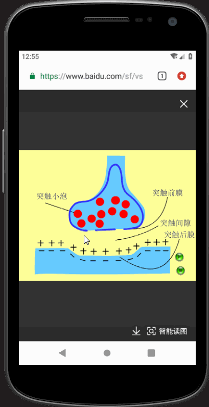
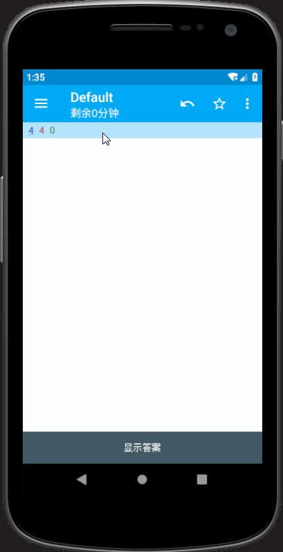
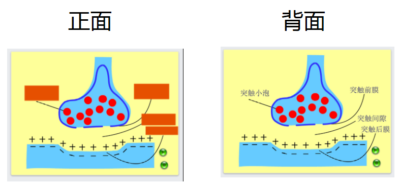
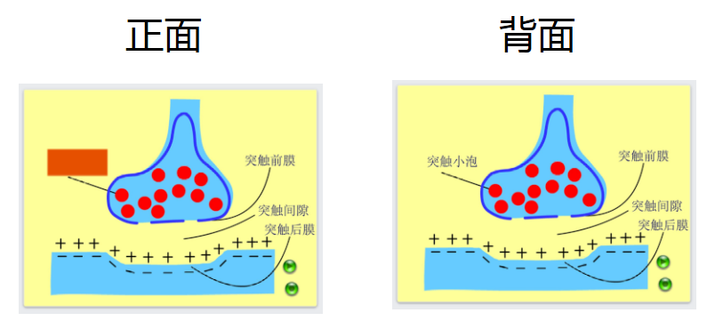
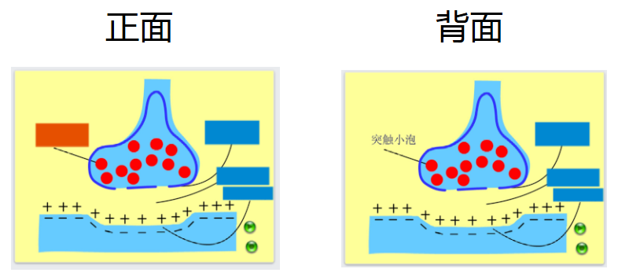

# Anki 涂鸦制卡

## 简介

“Anki 涂鸦制卡”([下载地址](https://github.com/mmjang/Ankillusion/releases/download/v1.1.0/Anki.Doodle.v1.1.0.apk))可快速地在图片上进行知识点遮挡并制作记忆卡片。

图片遮挡流程：

卡片复习：

“Anki 涂鸦制卡”需要配合记忆卡片软件 Ankidroid（[下载地址](https://www.coolapk.com/apk/com.ichi2.anki
)）使用。使用前需**确保**安装了 Ankidroid。

## 特性

图片可来自图库、相机、应用间分享；

可对图片进行翻转和裁剪这两种预处理流程；

遮挡矩形支持缩放、移动、旋转和删除操作；

支持3种制卡模式：

1. **全遮全显** 制作一张卡片，正面全部遮挡，反面全部显示；

2. **单遮单显** 根据遮挡矩形区域数量制作多张卡片，每张卡片依次遮挡各个矩形；

3. **全遮单显** 根据遮挡矩形区域数量制作多张卡片，每张卡片正面遮挡所有区域并依次高亮单个区域，背面仅显示高亮区域。

